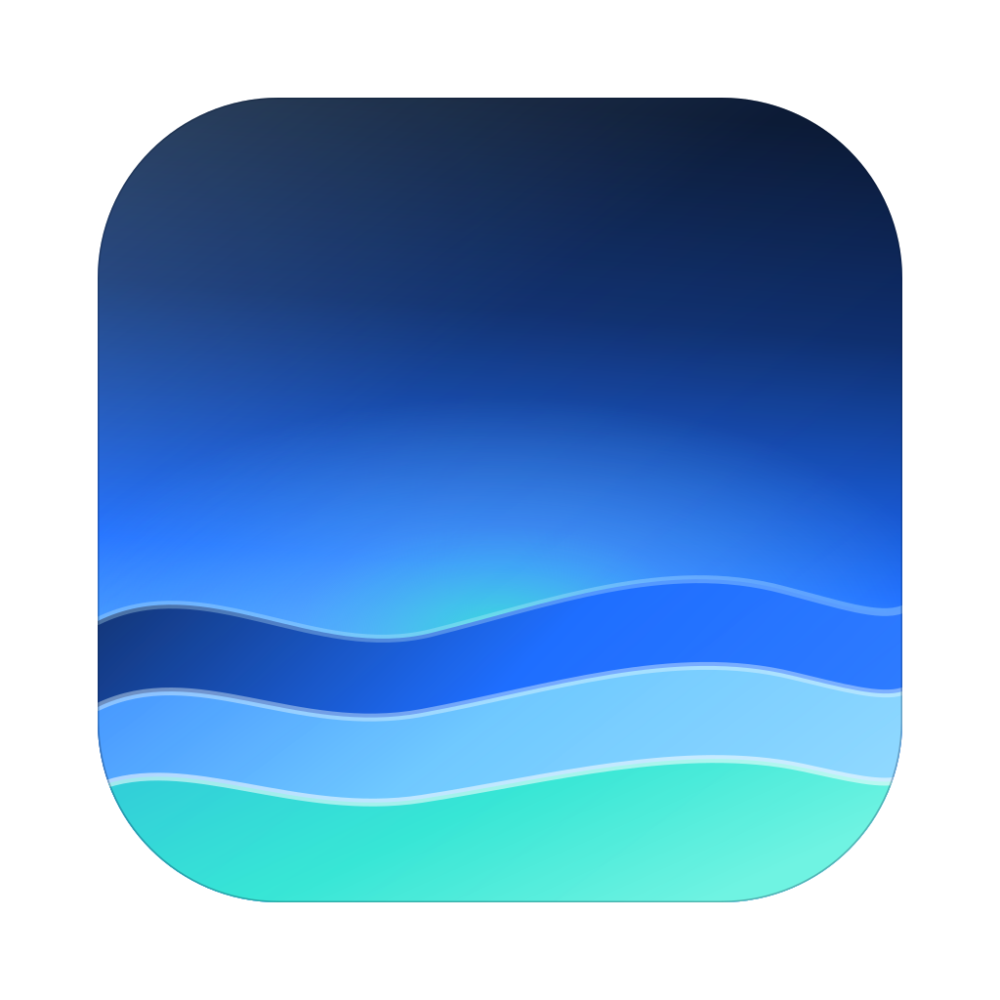

<div align="center">



# conduit

**Let AI agents use your computer — the way a person does.**
Looking at the screen, moving a cursor, clicking, typing.

[](https://github.com/oneauraaa/conduit/actions/workflows/build.yml)
&nbsp;·&nbsp; macOS 14+ &nbsp;·&nbsp; Windows 10 1903+ / 11

</div>

---

conduit **is** the MCP server. It exposes 22 computer-use tools on localhost, so
any agent — Claude Code, Codex, Hermes, OpenClaw — can drive the machine, but
only while conduit is running. Quit it from the tray and the endpoint dies with
it. That is the security model, and it is why the window's `x` hides to the tray
instead of quitting.

While an agent is driving, the machine shows it: an aqua glow breathes around
every screen edge, the AI's cursor is a glowing orb with a comet trail, and a
control pill floats above the Dock or taskbar with a live readout, a mode switch
and a stop button. Hold **Escape** for 800ms to take control back from anywhere.

## Install

Grab the zip for your platform from [Releases](../../releases). No installer.

- **Windows** — unzip, run `conduit.exe`. Needs the WebView2 runtime, which
  Windows 11 already has.
- **macOS** — unzip, move `conduit.app` to Applications. Grant Accessibility and
  Screen Recording when the Server tab asks.

Neither build is signed, so the first launch needs one click past SmartScreen or
Gatekeeper.

## Connect an agent

The Agents tab installs the endpoint with one click, backing the existing config
up first. By hand it is just a URL:

```bash
claude mcp add --transport http conduit http://127.0.0.1:6767/mcp --scope user
```

The Tailscale tab can publish that endpoint at a public HTTPS address for agents
that live on the web. The URL carries a 128-bit secret in its path, and **that
key is the entire lock** — anyone holding the full URL can use every tool you
left enabled.

## Safety

Every call funnels through one gate (`src-tauri/src/mcp/gate.rs`): panic stop →
tools access → per-tool switch → mode → run and log.

| mode | behaviour |
|---|---|
| manual | every action waits for approval |
| auto | reads run; `run_shell`, `clipboard_write`, `quit_app` ask |
| full access *(default)* | nothing asks |

Three things stay out of an agent's reach by construction: the tool allowlist
(the pill can loosen a session's *mode*, never which tools exist), conduit's own
windows (they reject synthetic clicks, so an agent cannot click its own
permissions up), and the panic stop (latched until you hand control back).

Browser clients are refused unless you name their origin in Settings — this
endpoint has no authentication, so an open CORS header would let any page you
visit drive the machine.

## Develop

```bash
pnpm install
pnpm tauri dev                 # the app
pnpm dev                       # the UI alone, in a browser, against sample data
pnpm package                   # a release zip in dist-release/
cd src-tauri && cargo test --lib
```

Everything that touches an OS API lives behind `src-tauri/src/platform/`, with
two backends exposing identical signatures — `contract.rs` fails to compile if
they drift, and `mcp/tools.rs` contains no `#[cfg]` at all.

```
src/                  React 19 · Tailwind v4 · Motion · Lucide
src-tauri/src/
  mcp/gate.rs         the one permission choke point
  mcp/tools.rs        the 22 tools
  platform/mac/       AppKit · Quartz · ScreenCaptureKit · AX
  platform/win/       Win32 · Windows.Graphics.Capture · UI Automation
```

Traps worth knowing before you touch either backend live in
[docs/notes.md](docs/notes.md).

## Brand

Sky above, waves below — the icon is the whole palette, abyss through foam.

| | token | hex |
|---|---|---|
| ⬛ | abyss | `#04122E` |
| 🟦 | deep | `#0A2A6B` |
| 🟦 | blue | `#1B6BFF` |
| 🔵 | sky | `#6EC8FF` |
| 🟩 | aqua | `#35E6D5` |
| ⬜ | foam | `#CFF7FF` |

Type is the system UI stack — SF Pro on macOS, Segoe UI Variable on Windows —
with SF Mono / JetBrains Mono for anything an agent might type. The product is
lowercase throughout, including its own name.

## Licence

[MIT](LICENSE)
